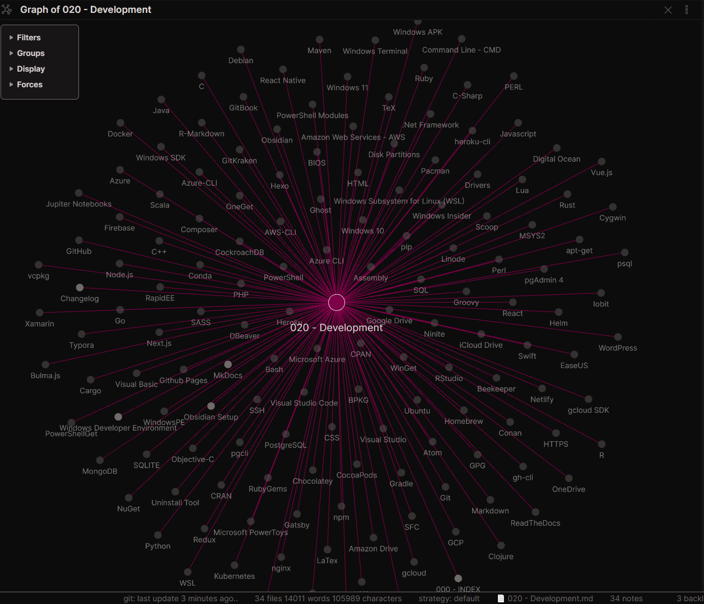

# 020 - Development

## Contents

- [Windows Developer Environment](#Windows%20Developer%20Environment)
- [Languages and Command Line Interfaces (CLI)](#Languages%20and%20Command%20Line%20Interfaces%20(CLI))
	- [Containers and Orchestration](#Containers%20and%20Orchestration)
	- [Javascript Frameworks](#Javascript%20Frameworks)
- [Software, Apps, and Tools](#Software,%20Apps,%20and%20Tools)
	- [Terminals and Shells](#Terminals%20and%20Shells)
	- [Text Editors & IDEs](#Text%20Editors%20&%20IDEs)
		- [Markdown Editors and Documentation](#Markdown%20Editors%20and%20Documentation)
	- [Version Control](#Version%20Control)
	- [Package Managers](#Package%20Managers)
		- [Windows Package Managers](#Windows%20Package%20Managers)
		- [UNIX Package Managers](#UNIX%20Package%20Managers)
		- [Language or Application Level Specific Package Managers](#Language%20or%20Application%20Level%20Specific%20Package%20Managers)
	- [Hosting and Cloud Service Providers](#Hosting%20and%20Cloud%20Service%20Providers)
	- [Command Line Interfaces for the Cloud:](#Command%20Line%20Interfaces%20for%20the%20Cloud:)
	- [Static Site Generators](#Static%20Site%20Generators)
	- [Databases](#Databases)
		- [Database GUIs](#Database%20GUIs)
		- [Database CLIs](#Database%20CLIs)
	- [Utilities](#Utilities)

## Windows Developer Environment

[Windows Developer Environment](../2-Slipbox/Windows%20Developer%20Environment.md) | [Windows-Development-Environment.pdf](../2-Slipbox/assets/Windows-Development-Environment.pdf)

[Windows Subsystem for Linux (WSL)](Windows%20Subsystem%20for%20Linux%20(WSL))

[[DotNet Framework]] | [MOC - PowerShell](MOC%20-%20PowerShell.md) | [Windows Terminal](Windows%20Terminal.md) | [Visual Studio](Visual%20Studio) | [Visual Studio Code](Visual%20Studio%20Code) | [NuGet](NuGet)

[Windows SDK](Windows%20SDK) | [Windows APK](Windows%20APK) | [WindowsPE](WindowsPE)

[DISM](DISM) | [SFC](SFC) | [Drivers](Drivers) | [BIOS](BIOS) | [Disk Partitions](Disk%20Partitions)

[Windows Insider](Windows%20Insider) | [Windows 10](Windows%2010) | [Windows 11](Windows%2011)

## Languages and Command Line Interfaces (CLI)

- [[MOC - R|R]]
- [SQL](SQL)
- [Visual Basic](Visual%20Basic)
- [Nodejs](Nodejs)
- [Python](../2-Slipbox/Python.md)
- [Javascript](../2-Slipbox/Javascript.md)
- [CSS](CSS) | [SASS](SASS)
- [HTML](HTML)
- [SSH](SSH)
- [Ruby](Ruby)
- [Rust](Rust)
- [Go](Go)
- [PHP](PHP)
- [C++](C++) | [C](C) | [C-Sharp](C-Sharp)
- [Assembly](Assembly)
- [Swift](Swift) | [Objective-C](Objective-C)
- [Java](Java)
- [Groovy](Groovy)
- [.Net Framework](.Net%20Framework)
- [Xamarin](Xamarin)
- [Perl](Perl)
- [Scala](Scala)
- [Lua](Lua)
- [Clojure](Clojure)
- [Markdown](../2-Slipbox/Markdown.md) | [LaTex](LaTex) | [TeX](TeX)
- [MOC - PowerShell](MOC%20-%20PowerShell.md)
- [Command Line - CMD](Command%20Line%20-%20CMD) (DOS)
- [Windows Subsystem for Linux (WSL)](Windows%20Subsystem%20for%20Linux%20(WSL).md) | [Ubuntu](Ubuntu)
- [Bash](Bash) | [Git-Bash](Git)

### Containers and Orchestration

- [Docker Best Practices](../2-Slipbox/Docker%20Best%20Practices.md)
- [Kubernetes](Kubernetes)
- [nginx](nginx)

### Javascript Frameworks

- [React](React) | [React Native](React%20Native) | [Redux](Redux)
- [Vue.js](Vue.js)
- [Bulma.js](Bulma.js)
- [Next.js](Next.js)

## Software, Apps, and Tools

### Terminals and Shells

- [Windows Terminal](Windows%20Terminal.md)
- [MOC - PowerShell](MOC%20-%20PowerShell.md)
- [Command Line - CMD](Command%20Line%20-%20CMD) (DOS)
- [Windows Subsystem for Linux (WSL)](Windows%20Subsystem%20for%20Linux%20(WSL).md) | [Ubuntu](Ubuntu)
- [Bash](Bash) | [Git-Bash](Git)

### Text Editors & IDEs

- [Visual Studio Code](Visual%20Studio%20Code)
- [RStudio](RStudio)
- [Atom](Atom)

#### Markdown Editors and Documentation

- [Typora](Typora)
- [Obsidian Links List](../2-Slipbox/Obsidian%20Links%20List.md)
- [R-Markdown](R-Markdown)
- [Jupiter Notebooks](Jupiter%20Notebooks)

### Version Control

- [Git](Git)
- [GitHub](GitHub)
- [GitKraken](GitKraken)

Also: [HTTPS](HTTPS), [SSH](SSH), and [GPG](GPG) for integration with [Git](Git). 

### Package Managers

> [Package manager - Wikipedia](https://en.wikipedia.org/wiki/Package_manager)

#### Windows Package Managers

- [NuGet](NuGet) | [PowerShellGet](../2-Slipbox/PowerShellGet.md) | [OneGet](OneGet) | [PowerShell Modules](PowerShell%20Modules)
- [Chocolatey](Chocolatey) | [Scoop](Scoop) | [WinGet](WinGet)
- [Cygwin](Cygwin)
- [Ninite](Ninite)
- [Pacman](Pacman) - [MSYS2](MSYS2)-ported Windows version of the Arch Linux package Manager.
- [vcpkg](vcpkg)
- [Homebrew](Homebrew) - only with [Windows Subsystem for Linux (WSL)](Windows%20Subsystem%20for%20Linux%20(WSL).md)

#### UNIX Package Managers

- [apt-get](apt-get) for [Ubuntu](Ubuntu) and [Debian](Debian) Based OS's
- [Homebrew](Homebrew) for MacOS and most Linux OS's

#### Language or Application Level Specific Package Managers

- [npm](npm) and [yarn](yarn) for [Node.js](Node.js) and [Javascript](../2-Slipbox/Javascript.md)
- [pip](pip) for [Python](../2-Slipbox/Python.md) (also [Conda](Conda))
- [Cargo](Cargo) for [Rust](Rust)
- [CRAN](CRAN) for [R](R)
- [CPAN](CPAN) for [PERL](PERL)
- [Gradle](Gradle) for [Groovy](Groovy) and other JVM Languages plus [C++](C++)
- [Maven](Maven) for [Java](Java)
- [Go](Go) has its own intern provider for [Go](Go)
- [Composer](Composer) for [PHP](PHP)
- [Conan](Conan) for [C++](C++)
- [Helm](Helm) for [Kubernetes](Kubernetes)
- [RubyGems](RubyGems) for [Ruby](Ruby)
- [BPKG](BPKG) for [Bash](Bash)
- [CocoaPods](CocoaPods) for [Swift](Swift)

### Hosting and Cloud Service Providers

- [Google Cloud Platform - GCP](Google%20Cloud%20Platform%20-%20GCP) | [gcloud](gcloud) | [Firebase](Firebase)
- [Microsoft Azure](Microsoft%20Azure) | [Azure CLI](Azure%20CLI)
- [Amazon Web Services - AWS](Amazon%20Web%20Services%20-%20AWS)
- [Heroku](Heroku)
- [Digital Ocean](Digital%20Ocean)
- [Linode](Linode)
- [Netlify](Netlify)
- [Github Pages](Github%20Pages)
- [WordPress](WordPress)

For Storage:

- [Google Drive](Google%20Drive)
- [OneDrive](OneDrive)
- [Amazon Drive](Amazon%20Drive)
- [iCloud Drive](iCloud%20Drive)

### Command Line Interfaces for the Cloud:

- [gcloud SDK](gcloud%20SDK) for [GCP](GCP)
- [Azure-CLI](Azure-CLI) for [Azure](Azure)
- [AWS-CLI](AWS-CLI)
- [heroku-cli](heroku-cli)
- [gh-cli](gh-cli)

### Static Site Generators

- [2-Slipbox/MkDocs](../2-Slipbox/MkDocs.md)
- [Hexo](Hexo)
- [Next.js](Next.js)
- [Ghost](Ghost)
- [Gatsby](Gatsby)
- [GitBook](GitBook)
- [ReadTheDocs](ReadTheDocs)

### Databases

- [MOC - PostgreSQL](MOC%20-%20PostgreSQL.md)
- [MongoDB](MongoDB)
- [CockroachDB](CockroachDB)
- [MySQL](MySQL)
- [SQLITE](SQLITE)

#### Database GUIs

- [pgAdmin 4](pgAdmin%204)
- [DBeaver](DBeaver)
- [Beekeeper](Beekeeper)

#### Database CLIs

- [psql](psql)
- [pgcli](pgcli)

### Utilities

- [Microsoft PowerToys](Microsoft%20PowerToys)
- [RapidEE](RapidEE)
- [Lepton](Lepton)
- [Uninstall Tool](Uninstall%20Tool)
- [EaseUS](EaseUS) Suite
- [Iobit](Iobit) Suite

***

***

Links: 

Sources:

