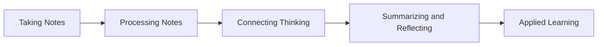

# Focused Note Taking via the Cornell Notes Method

```ad-important

It is essential that the structure of the notes one makes are shaped by the desired, intended use case for those specific notes.

```

## Overview


	
1. **Taking Notes**: Create the notes. Select a note-taking format, set up the note page, record the Essential Question, and take notes based on an information source (lecture, book, website, article, video, etc.), selecting, paraphrasing, and arranging information in a way that meets your note-taking objective. 
<br>
2. **Processing Notes**: Think about the notes. Revise notes—by underlining, highlighting, circling, chunking, questioning, adding, deleting—to identify, select, sort, organize, and classify main ideas and details. Evaluate the relative importance of information and ideas in the notes. 
<br>
3. **Connecting Thinking**: Think beyond the notes. Analyze the notes using inquiry to make connections and deepen content knowledge by asking questions and adding your own thinking to create greater understanding, identify gaps or points of confusion, and connect your new learning to what you already know. 
<br>
4. **Summarizing and Reflecting on Learning**: Think about the notes as a whole. Pull together the most important aspects of your notes and your thinking about them to craft a summary that captures the meaning and importance of the content and reflects on how the learning helps you meet the note-taking objective.
<br>
5. **Applying Learning**: Use the notes. Save and revisit your notes as a resource or learning tool to help you apply or demonstrate what you have learned

## Structure

![[Pasted image 20210726182405.png]]


***

Links: 

Sources:
- [The Cornell Note Taking System – Learning Strategies Center](https://lsc.cornell.edu/how-to-study/taking-notes/cornell-note-taking-system/)
- [Focused Note Taking (taughtbytolman.com)](https://www.taughtbytolman.com/focused-note-taking.html#:~:text=%20How%20to%20take%20Focused%20Notes%20%201,write%20these%20in%20the%20left%20column.%20More%20)

