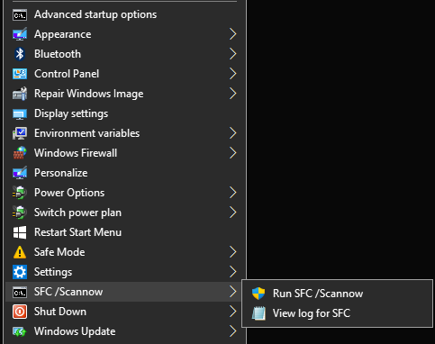
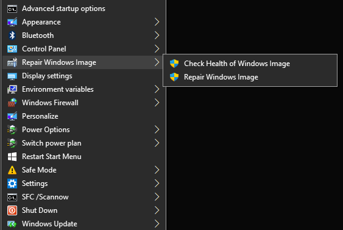

# SFC Scannow and DISM Commands

On Windows 10, when you start noticing random errors, problems booting up, or features not working as expected, there's a good chance that one or multiple system files might have gone missing or corrupted for unknown reasons. Usually, problems with system files could occur as a result of an issue installing a system update, driver, or application, or while making changes to the installation manually.

If you happen to come across this issue, you can use the Windows 10 System File Checker (SFC), which is a command-line tool designed to scan the integrity and restore missing or corrupted system files with working replacements.

Use the System File Checker tool to repair damaged system files automatically or manually if the tool refuses to work.

***

On windows these commands are crucial for keeping a clean system. I run these commands so often that I made a `.reg` registry entry script to add them to my Desktop’s Context Menu (see below for details or visit [my dotfiles repo](https://github.com/jimbrig/jimsdots) for the actual `.reg` scripts to run:

***

 1. The *System File Checker* - `sfc /scannow`
 2. The *Deployment Image Servicing and Management* tool - `DISM.exe`

*NOTE: these must be ran as an ADMINISTRATOR*

```powershell
# powershell or CMD as ADMIN

# system file checker
sfc /scannow

# DISM
Dism /Online /Cleanup-Image /ScanHealth
Dism /Online /Cleanup-Image /CheckHealth
Dism /Online /Cleanup-Image /RestoreHealth
```

## SFC

- Visit Microsoft's Docs on SFC - [Link](https://docs.microsoft.com/en-us/windows-server/administration/windows-commands/sfc)

The `sfc /scannow` command is a well known way to do an integrity check of all Windows 10 system files. `sfc.exe` is the *System File Checker* tool which can be helpful in many scenarios and fix various issues with Windows 10. You can save you time by adding a special context menu entry to launch it directly with one click.

### Add SFC /Scannow to Desktop Context Menu:



Registry Script:

```regedit
Windows Registry Editor Version 5.00

[HKEY_CLASSES_ROOT\DesktopBackground\Shell\SFCScannow]
"Icon"="cmd.exe"
"MUIVerb"="SFC /Scannow"
"Position"="Bottom"
"SubCommands"=""

[HKEY_CLASSES_ROOT\DesktopBackground\shell\SFCScannow\shell\01Scannow]
"HasLUAShield"=""
"MUIVerb"="Run SFC /Scannow"

[HKEY_CLASSES_ROOT\DesktopBackground\shell\SFCScannow\shell\01Scannow\command]
@="PowerShell -windowstyle hidden -command \"Start-Process cmd -ArgumentList '/s,/k, sfc.exe /scannow' -Verb runAs\""

[HKEY_CLASSES_ROOT\DesktopBackground\shell\SFCScannow\shell\02ViewLog]
"MUIVerb"="View log for SFC"

[HKEY_CLASSES_ROOT\DesktopBackground\shell\SFCScannow\shell\02ViewLog\command]
@="PowerShell (Select-String [SR] $env:windir\\Logs\\CBS\\CBS.log -s).Line >\"$env:userprofile\\Desktop\\SFC_LOG.txt\""
```

## DISM

- Visit Microsoft's Official Docs on DISM - [Link](https://docs.microsoft.com/en-us/windows-hardware/manufacture/desktop/what-is-dism)
- [How to Fix Windows 10 using DISM (winaero.com)](https://winaero.com/blog/fix-windows-10-using-dism/)

Deployment Image Servicing and Management (DISM.exe) is a command-line tool that can be used to service and prepare Windows images, including those used for Windows PE, Windows Recovery Environment (Windows RE) and Windows Setup. DISM can be used to service a Windows image (.wim) or a virtual hard disk (.vhd or.vhdx).

The Component store is a core feature of Windows 10 which stores all of the files related to the OS grouped by components and as hardlinks. With new servicing model introduced in Vista, some system files are shared between two components and they are all hardlinked to the system32 folder. When the OS is serviced, the component store is updated. The Component Store is part of the Windows Imaging and Servicing stack.

There is a special console tool called DISM which ships with Windows 10 by default. It can be used to fix Windows Component Store corruption. It is especially useful when the usual command "[sfc /scannow](https://winaero.com/blog/add-sfc-scannow-context-menu-in-windows-10/)" cannot repair damaged system files.

The DISM tool writes the following log files:

- C:\Windows\Logs\CBS\CBS.log
- C:\Windows\Logs\DISM\dism.log

They can be used to analyze errors and see completed operations.

### Add DISM to Desktop Context Menu:



Registry Script:

```regedit
Windows Registry Editor Version 5.00

[HKEY_CLASSES_ROOT\DesktopBackground\Shell\DismContextMenu]
"Icon"="WmiPrvSE.exe"
"MUIVerb"="Repair Windows Image"
"Position"="Bottom"
"SubCommands"=""

[HKEY_CLASSES_ROOT\DesktopBackground\shell\DismContextMenu\shell\CheckHealth]
"HasLUAShield"=""
"MUIVerb"="Check Health of Windows Image"

[HKEY_CLASSES_ROOT\DesktopBackground\shell\DismContextMenu\shell\CheckHealth\command]
@="PowerShell -windowstyle hidden -command \"Start-Process cmd -ArgumentList '/s,/k, Dism /Online /Cleanup-Image /CheckHealth' -Verb runAs\""

[HKEY_CLASSES_ROOT\DesktopBackground\shell\DismContextMenu\shell\RestoreHealth]
"HasLUAShield"=""
"MUIVerb"="Repair Windows Image"

[HKEY_CLASSES_ROOT\DesktopBackground\shell\DismContextMenu\shell\RestoreHealth\command]
@="PowerShell -windowstyle hidden -command \"Start-Process cmd -ArgumentList '/s,/k, Dism /Online /Cleanup-Image /RestoreHealth' -Verb runAs\""
```

### How it Works

*Check Health of Windows Image.* This command executes DISM as follows: `Dism /Online /Cleanup-Image /CheckHealth`. The key option here is CheckHealth. We use it to check if some process has marked the Component Store as corrupted and whether the corruption is repairable. This command is not supposed to fix any issues. It only reports about problems if they are present and if the CBS store is flagged. This command doesn't create a log file.

*Repair Windows Image*. This command starts DISM with the following arguments: `Dism /Online /Cleanup-Image /RestoreHealth`. The DISM tool started with the /RestoreHealth option will scan the component store for corruption and perform the required repair operations automatically. It will create a log file. The whole process can take several hours, so be patient. On hard drives, it will take longer compared to an SSD.

Both commands start [elevated from PowerShell](https://winaero.com/blog/start-a-process-elevated-from-powershell/).

### Removing Registry Edits

To undo the Context Menu REGEDIT entries here’s the scripts:

Remove SFC Context Menu:

```
Windows Registry Editor Version 5.00

[-HKEY_CLASSES_ROOT\DesktopBackground\Shell\SFCScannow]
```

Remove DISM Context Menu:

```regedit
Windows Registry Editor Version 5.00

[-HKEY_CLASSES_ROOT\DesktopBackground\Shell\DismContextMenu]
```

***

JIMMY BRIGGS - 2021


