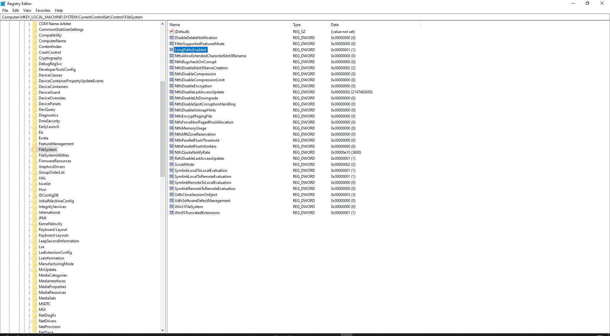

# Windows Registry Locations `fas:Windows`

## Long Path Support

- Key Path: `Computer\HKEY_LOCAL_MACHINE\SYSTEM\CurrentControlSet\Control\FileSystem`
- Key Value Name: `LongPathsEnabled`
- Key Value Type: `REG_DWORD`
- Key Value Data: `1`

## Explorer Drive Icons

*I use this to tweak any icons associated with a mapped or mounted drive (i.e. G: Google Drive, etc.)*

- Key Path: `Computer\HKEY_LOCAL_MACHINE\SOFTWARE\Microsoft\Windows\CurrentVersion\Explorer\DriveIcons\<Drive Letter>\DefaultIcon`
- Key Value Name: `(Default)`
- Key Value Type: `REG_SZ`
- Key Value Data: *Quoted Absolute Path to an Icon (`.ico`) file*.

***

Links: [Windows Registry](Windows%20Registry.md) | [How To Change Explorer Drive Icons via Registry](How%20To%20Change%20Explorer%20Drive%20Icons%20via%20Registry.md)

Sources: See [Windows Registry > Resources](Windows%20Registry#Resources).

