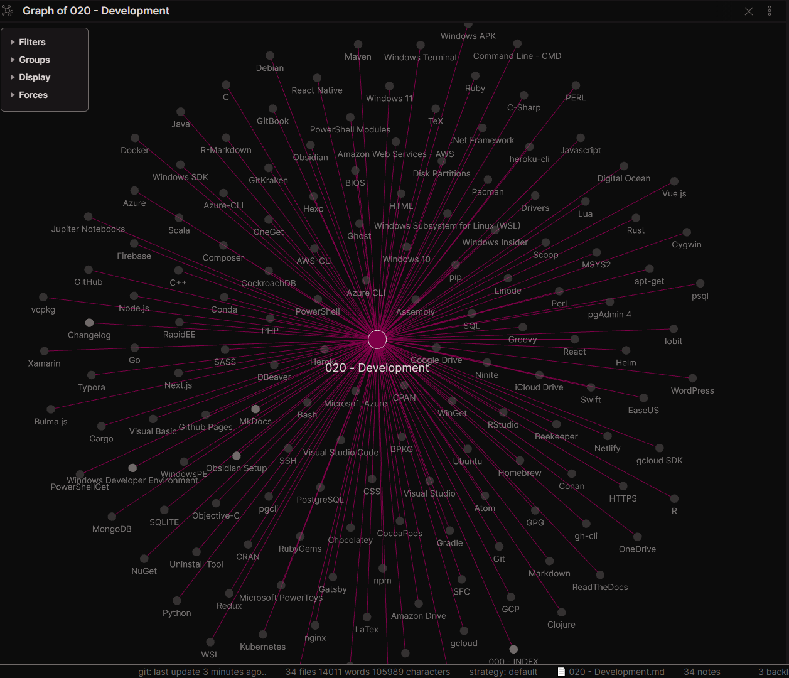

# 020 - Development

## Contents

- [Windows Developer Environment](#Windows%20Developer%20Environment)
- [Languages and Command Line Interfaces (CLI)](#Languages%20and%20Command%20Line%20Interfaces%20(CLI))
	- [Containers and Orchestration](#Containers%20and%20Orchestration)
	- [Javascript Frameworks](#Javascript%20Frameworks)
- [Software, Apps, and Tools](#Software,%20Apps,%20and%20Tools)
	- [Terminals and Shells](#Terminals%20and%20Shells)
	- [Text Editors & IDEs](#Text%20Editors%20&%20IDEs)
		- [Markdown Editors and Documentation](#Markdown%20Editors%20and%20Documentation)
	- [Version Control](#Version%20Control)
	- [Package Managers](#Package%20Managers)
		- [Windows Package Managers](#Windows%20Package%20Managers)
		- [UNIX Package Managers](#UNIX%20Package%20Managers)
		- [Language or Application Level Specific Package Managers](#Language%20or%20Application%20Level%20Specific%20Package%20Managers)
	- [Hosting and Cloud Service Providers](#Hosting%20and%20Cloud%20Service%20Providers)
	- [Command Line Interfaces for the Cloud:](#Command%20Line%20Interfaces%20for%20the%20Cloud:)
	- [Static Site Generators](#Static%20Site%20Generators)
	- [Databases](#Databases)
		- [Database GUIs](#Database%20GUIs)
		- [Database CLIs](#Database%20CLIs)
	- [Utilities](#Utilities)

## Windows Developer Environment

[Windows Developer Environment](../2-Slipbox/Windows%20Developer%20Environment.md) | [Windows-Development-Environment.pdf](../2-Slipbox/assets/Windows-Development-Environment.pdf)

[Windows Subsystem for Linux (WSL)](../2-Slipbox/Windows%20Subsystem%20for%20Linux%20(WSL).md)

[[DotNet Framework]] | [MOC - PowerShell](MOC%20-%20PowerShell.md) | [Windows Terminal](../2-Slipbox/Windows%20Terminal.md) | [Visual Studio](../0-Inbox/Placeholders/Visual%20Studio.md) | [Visual Studio Code](../0-Inbox/Placeholders/Visual%20Studio%20Code.md) | [NuGet](../0-Inbox/Placeholders/NuGet.md)

[Windows SDK](../0-Inbox/Placeholders/Windows%20SDK.md) | [Windows APK](../0-Inbox/Placeholders/Windows%20APK.md) | [WindowsPE](../0-Inbox/Placeholders/WindowsPE.md)

[DISM](../0-Inbox/Placeholders/DISM.md) | [SFC](../0-Inbox/Placeholders/SFC.md) | [Drivers](../0-Inbox/Placeholders/Drivers.md) | [BIOS](../0-Inbox/Placeholders/BIOS.md) | [Disk Partitions](../0-Inbox/Placeholders/Disk%20Partitions.md)

[Windows Insider](../0-Inbox/Placeholders/Windows%20Insider.md) | [Windows 10](../0-Inbox/Placeholders/Windows%2010.md) | [Windows 11](../0-Inbox/Placeholders/Windows%2011.md)

## Languages and Command Line Interfaces (CLI)

- [[MOC - R.md]]
- [SQL](../0-Inbox/Placeholders/SQL.md)
- [Visual Basic](../0-Inbox/Placeholders/Visual%20Basic.md)
- [Nodejs](../0-Inbox/Placeholders/Nodejs.md)
- [Python](../2-Slipbox/Python.md)
- [Javascript](../2-Slipbox/Javascript.md)
- [CSS](../0-Inbox/Placeholders/CSS.md) | [SASS](../0-Inbox/Placeholders/SASS.md)
- [HTML](../0-Inbox/Placeholders/HTML.md)
- [SSH](../0-Inbox/Placeholders/SSH.md)
- [Ruby](../0-Inbox/Placeholders/Ruby.md)
- [Rust](../0-Inbox/Placeholders/Rust.md)
- [Go](../0-Inbox/Placeholders/Go.md)
- [PHP](../0-Inbox/Placeholders/PHP.md)
- [C++](../0-Inbox/Placeholders/C++.md) | [C](../0-Inbox/Placeholders/C.md) | [C#](../0-Inbox/Placeholders/C-Sharp.md)
- [Assembly](../0-Inbox/Placeholders/Assembly.md)
- [Swift](../0-Inbox/Placeholders/Swift.md) | [Objective-C](../0-Inbox/Placeholders/Objective-C.md)
- [Java](../0-Inbox/Placeholders/Java.md)
- [Groovy](../0-Inbox/Placeholders/Groovy.md)
- [[../0-Inbox/Placeholders/DotNet Framework.md]]
- [Xamarin](../0-Inbox/Placeholders/Xamarin.md)
- [Perl](../0-Inbox/Placeholders/Perl.md)
- [Scala](../0-Inbox/Placeholders/Scala.md)
- [Lua](../0-Inbox/Placeholders/Lua.md)
- [Clojure](../0-Inbox/Placeholders/Clojure.md)
- [Markdown](../2-Slipbox/Markdown.md) | [LaTex](../0-Inbox/Placeholders/LaTex.md) | [TeX](../0-Inbox/Placeholders/TeX.md)
- [MOC - PowerShell](MOC%20-%20PowerShell.md)
- [[MOC - Command Line.md]] (DOS)
- [Windows Subsystem for Linux (WSL)](../2-Slipbox/Windows%20Subsystem%20for%20Linux%20(WSL).md) | [Ubuntu](../0-Inbox/Placeholders/Ubuntu.md)
- [Bash](../0-Inbox/Placeholders/Bash.md) | [Git-Bash](../0-Inbox/Placeholders/Git.md)

### Containers and Orchestration

- [Docker Best Practices](../2-Slipbox/Docker%20Best%20Practices.md)
- [Kubernetes](../0-Inbox/Placeholders/Kubernetes.md)
- [Nginx](../0-Inbox/Placeholders/Nginx.md)

### Javascript Frameworks

- [React](../0-Inbox/Placeholders/React.md) | [React Native](../0-Inbox/Placeholders/React%20Native.md) | [Redux](Redux)
- [Vue.js](Vue.js)
- [Bulma.js](Bulma.js)
- [Next.js](Next.js)

## Software, Apps, and Tools

### Terminals and Shells

- [Windows Terminal](../2-Slipbox/Windows%20Terminal.md)
- [MOC - PowerShell](MOC%20-%20PowerShell.md)
- [[MOC - Command Line.md]]
- [Windows Subsystem for Linux (WSL)](../2-Slipbox/Windows%20Subsystem%20for%20Linux%20(WSL).md) | [Ubuntu](../0-Inbox/Placeholders/Ubuntu.md)
- [Bash](../0-Inbox/Placeholders/Bash.md) | [Git-Bash](../0-Inbox/Placeholders/Git.md)

### Text Editors & IDEs

- [Visual Studio Code](../0-Inbox/Placeholders/Visual%20Studio%20Code.md)
- [RStudio](../0-Inbox/Placeholders/RStudio.md)
- [Atom](../0-Inbox/Placeholders/Atom.md)

#### Markdown Editors and Documentation

- [Typora](../0-Inbox/Placeholders/Typora.md)
- [Obsidian Links List](../2-Slipbox/Obsidian%20Links%20List.md)
- [R-Markdown](../0-Inbox/Placeholders/R-Markdown.md)
- [Jupiter Notebooks](../0-Inbox/Placeholders/Jupiter%20Notebooks.md)

### Version Control

- [Git](../0-Inbox/Placeholders/Git.md)
- [GitHub](../0-Inbox/Placeholders/GitHub.md)
- [GitKraken](../0-Inbox/Placeholders/GitKraken.md)

Also: [HTTPS](../0-Inbox/Placeholders/HTTPS.md), [SSH](../0-Inbox/Placeholders/SSH.md), and [GPG](../0-Inbox/Placeholders/GPG.md) for integration with [Git](../0-Inbox/Placeholders/Git.md). 

### Package Managers

> [Package manager - Wikipedia](https://en.wikipedia.org/wiki/Package_manager)

#### Windows Package Managers

- [NuGet](../0-Inbox/Placeholders/NuGet.md) | [PowerShellGet](../2-Slipbox/PowerShellGet.md) | [OneGet](../0-Inbox/Placeholders/OneGet.md) | [PowerShell Modules](../0-Inbox/Placeholders/PowerShell%20Modules.md)
- [Chocolatey](../0-Inbox/Placeholders/Chocolatey.md) | [Scoop](../0-Inbox/Placeholders/Scoop.md) | [WinGet](../0-Inbox/Placeholders/WinGet.md)
- [Cygwin](../0-Inbox/Placeholders/Cygwin.md)
- [Ninite](../0-Inbox/Placeholders/Ninite.md)
- [Pacman](Pacman) - [MSYS2](MSYS2)-ported Windows version of the Arch Linux package Manager.
- [vcpkg](vcpkg)
- [Homebrew](Homebrew) - only with [Windows Subsystem for Linux (WSL)](../2-Slipbox/Windows%20Subsystem%20for%20Linux%20(WSL).md)

#### UNIX Package Managers

- [apt-get](apt-get) for [Ubuntu](../0-Inbox/Placeholders/Ubuntu.md) and [Debian](Debian) Based OS's
- [Homebrew](Homebrew) for MacOS and most Linux OS's

#### Language or Application Level Specific Package Managers

- [npm](../0-Inbox/Placeholders/npm.md) and [Yarn](../0-Inbox/Placeholders/Yarn.md) for [Node.js](Node.js) and [Javascript](../2-Slipbox/Javascript.md)
- [pip](../0-Inbox/Placeholders/pip.md) for [Python](../2-Slipbox/Python.md) (also [Conda](Conda))
- [Cargo](../0-Inbox/Placeholders/Cargo.md) for [Rust](../0-Inbox/Placeholders/Rust.md)
- [CRAN](../0-Inbox/Placeholders/CRAN.md) for [[MOC - R.md]]
- [CPAN](CPAN) for [PERL](../0-Inbox/Placeholders/Perl.md)
- [Gradle](Gradle) for [Groovy](../0-Inbox/Placeholders/Groovy.md) and other JVM Languages plus [C++](../0-Inbox/Placeholders/C++.md)
- [Maven](Maven) for [Java](../0-Inbox/Placeholders/Java.md)
- [Go](../0-Inbox/Placeholders/Go.md) has its own intern provider for [Go](../0-Inbox/Placeholders/Go.md)
- [Composer](Composer) for [PHP](../0-Inbox/Placeholders/PHP.md)
- [Conan](Conan) for [C++](../0-Inbox/Placeholders/C++.md)
- [Helm](../0-Inbox/Placeholders/Helm.md) for [Kubernetes](../0-Inbox/Placeholders/Kubernetes.md)
- [RubyGems](RubyGems) for [Ruby](../0-Inbox/Placeholders/Ruby.md)
- [BPKG](BPKG) for [Bash](../0-Inbox/Placeholders/Bash.md)
- [CocoaPods](CocoaPods) for [Swift](../0-Inbox/Placeholders/Swift.md)

### Hosting and Cloud Service Providers

- [[Google Cloud Platform - GCP]] | [[gcloud SDK]] | [[Firebase]]
- [[MOC - Microsoft Azure]] | [[Azure CLI]]
- [Amazon Web Services - AWS](../0-Inbox/Placeholders/Amazon%20Web%20Services%20-%20AWS.md)
- [Heroku](../0-Inbox/Placeholders/Heroku.md)
- [Digital Ocean](../0-Inbox/Placeholders/Digital%20Ocean.md)
- [Linode](../0-Inbox/Placeholders/Linode.md)
- [Netlify](../0-Inbox/Placeholders/Netlify.md)
- [Github Pages](../0-Inbox/Placeholders/Github%20Pages.md)
- [WordPress](../0-Inbox/Placeholders/WordPress.md)

For Storage:

- [Google Drive](../0-Inbox/Placeholders/Google%20Drive.md)
- [OneDrive](../0-Inbox/Placeholders/OneDrive.md)
- [Amazon Drive](../0-Inbox/Placeholders/Amazon%20Drive.md)
- [iCloud Drive](../0-Inbox/Placeholders/iCloud%20Drive.md)

### Command Line Interfaces for the Cloud:

- [gcloud SDK](../0-Inbox/Placeholders/gcloud%20SDK.md) for [[../0-Inbox/Placeholders/Google Cloud Platform - GCP.md]]
- [[../0-Inbox/Placeholders/Azure CLI.md]] for [[MOC - Microsoft Azure]]
- [[../0-Inbox/Placeholders/AWS-CLI.md]]
- [[../0-Inbox/Placeholders/Heroku-CLI.md]]
- [[../0-Inbox/Placeholders/Github-CLI.md]]

### Static Site Generators

- [[../2-Slipbox/MkDocs.md]]
- [[../0-Inbox/Placeholders/Hexo.md]]
- [NextJS](../0-Inbox/Placeholders/NextJS.md)
- [Ghost](../0-Inbox/Placeholders/Ghost.md)
- [Gatsby](../0-Inbox/Placeholders/Gatsby.md)
- [GitBook](../0-Inbox/Placeholders/GitBook.md)
- [ReadTheDocs](../0-Inbox/Placeholders/ReadTheDocs.md)

### Databases

- [MOC - PostgreSQL](MOC%20-%20PostgreSQL.md)
- [MongoDB](MongoDB)
- [CockroachDB](CockroachDB)
- [MySQL](MySQL)
- [SQLITE](SQLITE)

#### Database GUIs

- [pgAdmin 4](../0-Inbox/Placeholders/pgAdmin%204.md)
- [DBeaver](../0-Inbox/Placeholders/DBeaver.md)
- [Beekeeper](../0-Inbox/Placeholders/Beekeeper.md)

#### Database CLIs

- [psql](../0-Inbox/Placeholders/psql.md)
- [pgcli](../0-Inbox/Placeholders/pgcli.md)

### Utilities

- [Microsoft PowerToys](../0-Inbox/Placeholders/Microsoft%20PowerToys.md)
- [RapidEE](../0-Inbox/Placeholders/RapidEE.md)
- [Lepton](../0-Inbox/Placeholders/Lepton.md)
- [Uninstall Tool](../0-Inbox/Placeholders/Uninstall%20Tool.md)
- [EaseUS](../0-Inbox/Placeholders/EaseUS.md) Suite
- [Iobit](../0-Inbox/Placeholders/Iobit.md) Suite

***

***

Links: 

Sources:

