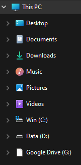
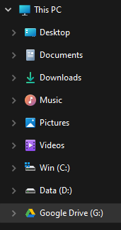
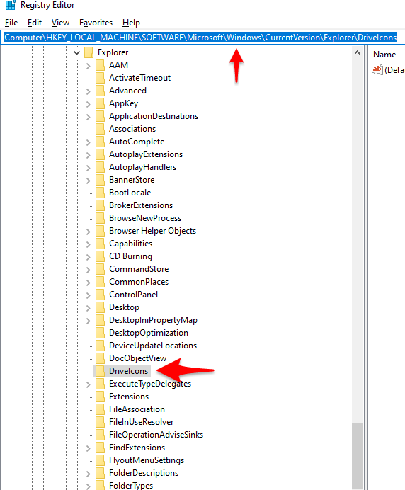
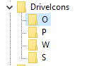
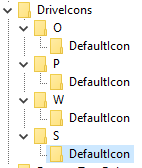
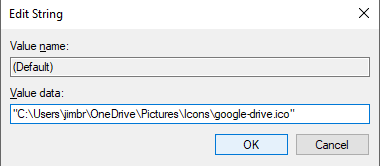

# How To Change Explorer Drive Icons via Registry

*See also: [Windows Registry Paths and Keys > Explorer Drive Icons](Windows%20Registry%20Paths%20and%20Keys#Explorer%20Drive%20Icons).*

## Contents

- [About](#About)
- [Preliminary Steps](#Preliminary%20Steps)
- [Create Nested `DriveIcons` Keys](#Create%20Nested%20`DriveIcons`%20Keys)
- [Export and Test Results](#Export%20and%20Test%20Results)

## Overview

If you need to change or fix missing drive icons in explorer, this guide shows how to accomplish this through the [Windows Registry](Windows%20Registry.md).

Personally, I use this to tweak any icons associated with a mapped or mounted drive (i.e. G: Google Drive, etc.).

Here are all the steps in order:

1.  Run `regedit`
2. Backup Registry via `File > Export` (optional)
3. Navigate to path: `Computer\HKEY_LOCAL_MACHINE\SOFTWARE\Microsoft\Windows\CurrentVersion\Explorer\DriveIcons`
4. Add Keys (folders) for each drive letter.
5. Create sub-keys (folders) nested under each drive letter named `DefaultIcon`.
6. Assign a value for each `Default` key value within the `DefaultIcon` sub-key as the *quoted absolute path to the ICO icon file on the hard drive*.
7.  Right click and `Export` the entire `DriveIcons` folder as a backup to future re-use.
8.  Exit registry and restart Windows Explorer in Task Manager to view updated icons.  

Before and After:

*Before*

*After*

## Preliminary Steps

1.  Run `regedit`

2. Backup Registry via `File > Export` (optional)

3. Navigate to path: `Computer\HKEY_LOCAL_MACHINE\SOFTWARE\Microsoft\Windows\CurrentVersion\Explorer\DriveIcons`:

## Create Nested `DriveIcons` Keys

4. Add Keys (folders) for each drive letter:

5. Create sub-keys (folders) nested under each drive letter named `DefaultIcon`:

**Note: Can also assign folders/keys for `DefaultLabels` here as well**

6. Assign a value for each `Default` key value within the `DefaultIcon` sub-key as the *quoted absolute path to the ICO icon file on the hard drive*:

## Export and Test Results

7.  Right click and `Export` the entire `DriveIcons` folder as a backup to future re-use.
    
8.  Exit registry and restart Windows Explorer in Task Manager to view updated icons.  

***

Internal Links: [Windows Registry Paths and Keys](Windows%20Registry%20Paths%20and%20Keys.md) | [050 - Computer](../1-Maps-of-Content/050%20-%20Computer.md)
External Links: [Link to Original Note I made in Evernote](https://www.evernote.com/shard/s694/nl/215210942/5408768b-06b3-4211-a923-131c595b16c9?title=Changing%20Windows%20Network%20Drive%20Icons%20and%20Labels%20via%20the%20Registry)
Sources: Original Source Unknown - From Evernote Note.

